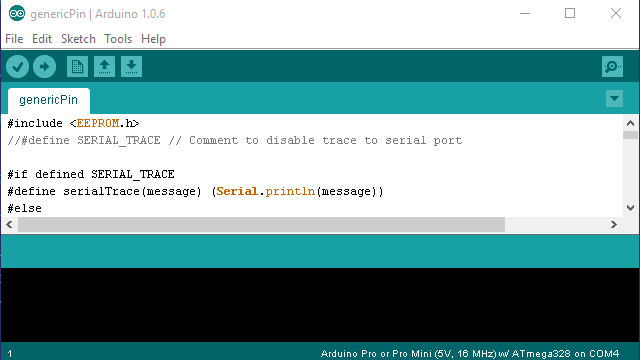

# Arduino GenericPin 1.0.0
Provides a serial interface to configure, control, and request Arduino pins state with commands.

## Features
* Digital, Analog and PWM pins are supported
* Pin configuration and initial state can be stored in EEPROM to survive reboots

## Usage
1. Upload [genericPin.ino](genericPin.ino) to Arduino board with [Arduino IDE](https://www.arduino.cc/en/Main/Software).
2. Open **Tools -> Serial Monitor** in Arduino IDE, type `FG` and press *Enter*. It will respond with the name and version of just flashed GenericPin firmware. Play with commands (described below) to check how they work.
3. From now on, Arduino Board is ready to be managed by any device (controller) that is able to communicate through serial port (e.g. [ESP8266](http://espressif.com/en/products/esp8266/) [board](https://en.wikipedia.org/wiki/ESP8266)). Just connect `Arduino RX` with `Controller TX`, and connect `Arduino TX` with `Controller RX`, and `Controller` will be able to send commands to `Arduino`.
4. Examples of commands that can be sent:

Command|Description
---|---
`CS P5 I0`|Configure 5th digital pin for input without pull-up resistor.
`DG P5`|Get the digital value of 5th digital pin.
`CE P9 OP`|Configure 9th digital pin for PWM output and store the configuration in EEPROM to survive reboots.
`PG P9`|Get the PWM value of 9th digital pin.
`AG P7`|Get the value of 7th analog pin.

## Commands

### Digital Pin Config Set
Configure digital pin and optionaly store configuration in EEPROM.

Command|Description
---|---
`CS Pn Cfg`|Set Pin Configuration (in RAM)
`CE Pn Cfg`|Set Pin Configuration (persistent, in EEPROM)

#### Parameters:
* **`Pn`** Pin number prefixed with `P`, e.g.: `P5`,`P13`
* **`Cfg`** Pin configuration parameters:

  Cfg|Description
  ---|---
  `I0`|Digital input without pull-up resistor
  `I1`|Digital input with pull-up resistor
  `OD`|Digital output
  `OP`|PWM output

#### Example:

Command|Description
---|---
`CS P5 I0`|Configure 5th digital pin for input without pull-up resistor.
`CE P8 OP`|Configure 8th digital pin for PWM output and store the configuration in EEPROM to survive reboots.

### Digital Pin Config Get
Return digital pin configuration previously set with `CS` or `CE` command.

Command|Description
---|---
`CG Pn`|Get Pin Configuration

#### Parameter:
* **`Pn`** Pin number prefixed with `P`, e.g.: `P5`,`P13`

#### Example:

Command|Description
---|---
`CG P5`|Get 5th digital pin configuration - returns `IO` if it was previously configured with `CS P5 I0`

### Digital Pin Set
Set digital pin output to either `0` or `1`.

Command|Description
---|---
`DS Pn Vn`|Set Pin output value
`DE Pn Vn`|Set Pin output value and store that setting in EEPROM. The output value will be automatically set on after restart.

#### Parameters:
* **`Pn`** Pin number prefixed with `P`, e.g.: `P5`,`P13`
* **`Vn`** Ouput Value prefixed with `V`, e.g.: `V0`, `V1`

#### Example:

Command|Description
---|---
`DS P2 V0`|Set the output of 2nd digital pin to `0`.
`DE P13 V1`|Set the output of 13th pin to `1`, and stores that setting in EEPROM. In case if LED attached to pin 13 (on most Arduino boards it is attached), it will be on after restart. 

### Digital Pin Get
Get the state of digital pin (for both input and output pins).

Command|Description
---|---
`DG Pn`|Get Pin value

#### Parameters:
* **`Pn`** Pin number prefixed with `P`, e.g.: `P5`,`P13`

#### Example:

Command|Description
---|---
`DG P2`|Get the state of 2nd digital pin.

### PWM Pin Set
Set PWM pin output to value from min `0` to max `1023`.

Command|Description
---|---
`PS Pn Vn`|Set Pin output value
`PE Pn Vn`|Set Pin output value and store that setting in EEPROM. The output value will be automatically set on after restart.

#### Parameters:
* **`Pn`** Pin number prefixed with `P`, e.g.: `P5`
* **`Vn`** Ouput Value prefixed with `V`, e.g.: `V5`, `V1023`

#### Example:

Command|Description
---|---
`PE P5 V42`|Set the PWM output of 5th digital pin to `42`, the state will be restored after Arduino restart.

### PWM Pin Get
Get the state of PWM output pin (the returned value will be in range `[0-1023]`).

Command|Description
---|---
`PG Pn`|Get Pin value

#### Parameters:
* **`Pn`** Pin number prefixed with `P`, e.g.: `P5`,`P11`

#### Example:

Command|Description
---|---
`PG P11`|Get the PWM value previusly set for 11th pin.

### Analog Get 
Get the analog pin state (the value from one of ADC pins). The value will be in range `[0-1023]`.

Command|Description
---|---
`AG Pn`|Get Pin value

#### Parameters:
* **`Pn`** Pin number prefixed with `P`, e.g.: `P6`

#### Example:

Command|Description
---|---
`AG P6`|Get the analog input value from ADC on 6th analog pin.

### Name Set
Assign a name to Arduino instance.

Command|Description
---|---
`NS NewName`|Store `NewName` in EEPROM.
`NE NewName`|Store `NewName` in EEPROM.

#### Parameters:
* **`NewName`** A name to be assigned to arduino board, e.g.: `Socket3`

#### Example:

Command|Description
---|---
`NS Socket3`|Name the Arduino board `Socket3`.

### Name Get
Returns the previously assigned name of the Arduino board.

Command|Description
---|---
`NG`|Return previously assigned board name from EEPROM.

#### Example:

Command|Description
---|---
`NG`|Return the name previously assigned with `NS NewName` command.

### Firmware Set
Various commands for modifying the state of the Arduino board.

Command|Description
---|---
`FS A`|Reset all the data in EEPROM to its initial state, restart Arduino
`FS P`|Reset port configuration in EEPROM, restart Arduino
`FS R`|Restart Arduino

#### Example:

Command|Description
---|---
`FS R`|Restart Arduino

### Firmware Get
Various commands for getting the state of the Arduino board.

Command|Description
---|---
`FG`|Get the firmware full name
`FG V`|Get the firmware version
`FG N`|Get the firmware name

#### Example:

Command|Description
---|---
`FG V`|Return the firmware version, e.g. `1.0.0`

## Notes:
* Nothing will be returned as a response to an invalid command by default. That is a workaround for ESP8266 sending some gibberish to UART on (re)start.
* Put word `DEBUG` before the command in order to debug it (e.g. `DEBUG PS P13 V512`). As the result, if command is ok, the usual "OK ..." answer will be returned, if command is wrong, the error message will be returned.
* Both PWM and Analog values are normalized to the same 10-bit basis: **min** = `0`, **max** = `1023`. 

## Flashing and testing:

## [License](LICENSE)
Copyright (c) 2015 Taras Greben
Licensed under the [Apache License](LICENSE).
